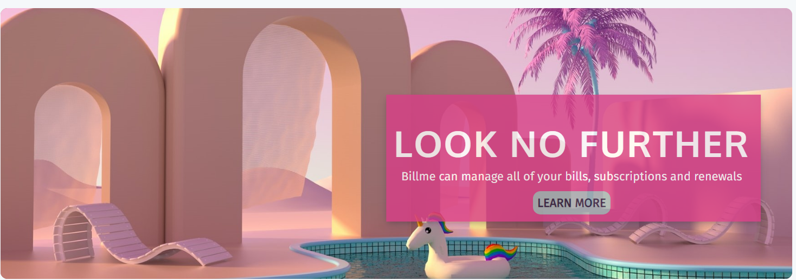
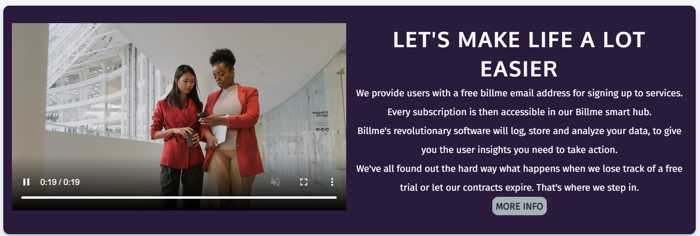
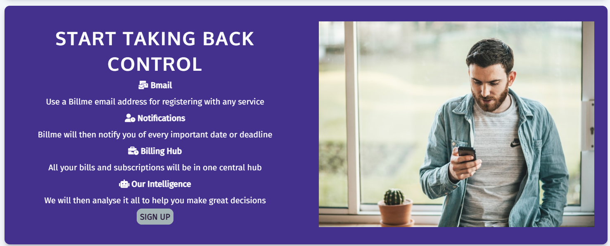
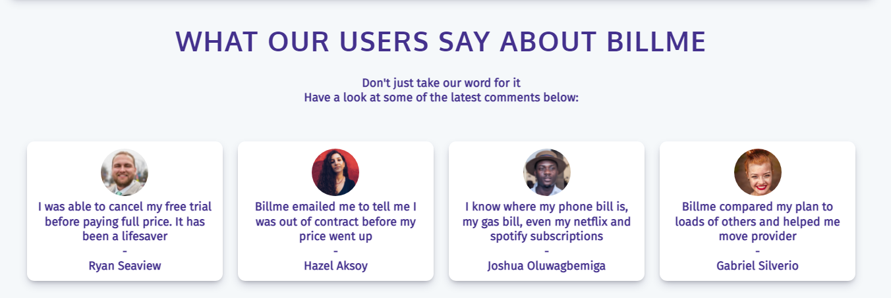
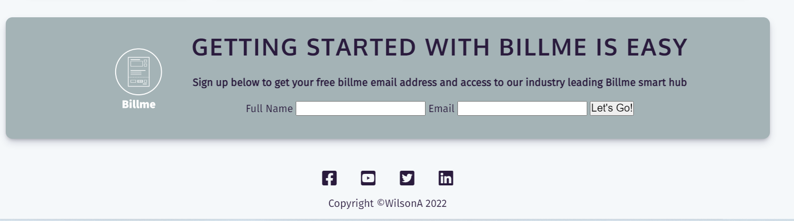

# Billme

Welcome to Billme. This website has been created for Billme a fintech business idea.

Billme is service that users sign up to consolidate all their bills, subscriptions, free trials etc by providing a billme email address for users to use at the sign up stage.
Users can then log in to the Billme website to manage all of these in one place. Billme then promises to provide vital insights in to upcoming renewal dates, comparision of subscriptions and plans and notifications of out of contract charges. Future development of the website and platform will offer these amazing AI capabilities. 

The purpose of this website is to act as a single landing page that Billme marketers will send traffic to from online advertising campaigns, social media or crm emails.
This will be the page that new visitors land on first and should interest them enough to sign up to Billme.

The goal is to create an easy to read page of relevent content. Supported with various media types it should educate visitors as to how Billme works and it's unique features.
Visitors will have enough information to intice/allow them to take action by signing up to Billme through a short sign up form.

## Targer Audience:
Visitors to the site will have shown some interest in Billme through lead generation campaigns.
Those with a general interest in new technologies
Those with a wish to use technology to have manage their life
Those who have never heard of Billme
Those who know a little about Billme and what to find out more inforamtion

### User Storys:
As a user I want to quickly know what Billme is about
As a user I want to easily navigate through short snippets of content
As a user I want to know what features Billme has
As a user I want to see testimonials from other users
As a user I want to know more
As a user I want to sign up

## User Experience:
* The structure of the site is based on landing pages for linking to the site externally, for examplefrom a marketing campaign.
* I looked for best practise in landing page design with some examples being:
  - [Salesforce](https://www.salesforce.com/eu/?ir=1)
  - [Gong](https://www.gong.io/)
  - [Revolut](https://www.revolut.com/)
  - [Justworks](https://justworks.com/)
* I also researched click funnel design to ensure the business goals of sucessfully converting visitors to sign ups.

I found that leading fintech websites tend to structure their pages with a center alignment using a wrapper div and/or a grid structure; with a margin left and right.
The sections all easily flow from one to next through great design and color schemes.
Revelent content and different media types support the text based messaging.

Their landing page user journeys tend to follow a similar path: 
 * A strong headline
 * A short about us or product explainer section
 * A unique value proposition or features section
 * A customer testimonials or awards section
 * A sign up or email subscription section

Based on this research I then began Billme's wireframes.

### The Wireframes 
With this research in mind the wireframes have both a desktop and mobile version showing the following sections:
- Header/Navigation
- Hero or Showcase
- About Billme 
- Features
- Reasons Why
- Sign Up 
- Footer

* Between mobile and Desktop I was able to make decisions as to how the content should be responsive to screensize and which solutions are needed between using floats, css flex and css grid. The wireframes only acted as a guide and the final design was tweeked as content and media was added. 

### Color Scheme
After researching color schemes I found **[Visme](https://visme.co/blog/website-color-schemes/) 50 Gorgeous Color Schemes From Award-Winning Websites**.
I looked for something engaging to give excitment to a fintech site. Based on the award winning [fcingq](https://www.fcinq.com/) website I used their scheme of dark cerise, royal purple and dark slate blue, as I found the colors blend well and produce both a beautiful and engaging site.

### Code Reusability:
The colors were set as CSS variables and used throughout the site.

### Fonts:
Fira Sans as the primary text font
Oxygen for H1, H2 text

### Logo:
I created the log using [Adobe-Express](https://express.adobe.com/express-apps/logomaker/preview)
The icon used was from [The-Noun-Project](https://thenounproject.com/icon/bill-149906/)

## Site Features
The site is a single landing page with several sections. Future development of the Billme idea will lead to a much more expansive website covering company, product, services, resources, support, pricing as well as the backend of the platform that users sign in to. 

### Header & Navigation Bar

* The navigation bar contains a logo that links to the index page.
* There are 3 links: About, Features, Sign up that navigate the user to the corresponding sections with the page.
* Using flex design the logo and links move center aligned on smaller screens. 

* When hovering over the links the background color changes

#### Hero Image
The hero image is set as a background and was selected to fit in with the color scheme and give a welcoming feeling. There is a zoom animation to catch the users attention and cover text is overlaid with a strong title message.

### The about section
The about section will give the user a visual introduction to the Billme platform through a video (the video is a stock placeholder) and also in text explains how Billme works in simple concise wording. This should create interest and allow the user to click the read more button or continue scrolling through the landing page. The section uses CSS grid to easily move from desktop to mobile.

### The feature section
The feature section outlines some of the key features and selling points of the platform. It should create a desire to sign up to bill me which can be done through the sign up button. The text contains icons from font-awesome to differentiate the points. The image within the section will change depending on the screen size using a picture tag and src set.

### The reasons section
The purpose of the reasons section is to provide customer testimonial to the Billme product and service. The section contains 4 boxes each displaying an image icon, message and user name. For any fintech product user reviews and testimonials are vital and some users will not take action without this type of content. The is laid out using flexbox and is responsive to screen size where is shows inline on mobile and side by side on desktop.

### The sign up section
The sign up section allows the user to sign up to Billme. It is a simple 2 field form which is set to GET but with future development will push to a database. Upon submitting and clicking Let's go the user is taken to a similar page but the text in the sign up section is replaced by a thank you message and next steps.

### The footer section
This section contains subtle yet recognisable icon links to Billmes social media sites and will open in a new tab upon clicking them.

## Testing:
Testing was done as each change was saved.
- Within gitpod I utilised the live server extension to see changes in real time.
- Using google developer tools I checked the responsiveness when changing screen sizing and used the desktop and mobile filters
- Upon pushing the code to github I ran the lighthouse reports for mobile and desktop.
- Lastly I ran the code through validators to looks for errors in html and css.

### Errors
- Initially I set some display to none for some image and videos as when viewing on mobile they distorted the grid sizing.
- As I learned more about setting sizing from tutorials I managed to set the widths to be responsive to smaller screens.
-  One error code that presented itself in the CSS validator was CSS grid - Parse Error (1fr, auto), thanks to Mark on Slack forums for helping resolve this by removing the commas.
-  Background image initially did not display on creating the github page. I changed the path to a relative URL and then added the background to the outer div which resolved this.
- One unresolved issue is the sizing of the sign up input fields between 400 and 800 width on viewports. I would like the label and input to align alongside each other. With time constraints I will resolve this at a future date.
### Lighthouse Report
Link to results. 
100% Accessability on mobile and desktop. There was a suggestion related to improving the space between the navigation links so a line-height was added to the nav-links section. The performance can be improved by hosting the video elsewhere and embeding. As the site grows and additional media is added all videos will be hosted elsewhere.

### HTML Validator
Document checking completed. No errors or warnings to show.

### CSS Validator:
W3C CSS Validator results for TextArea (CSS level 3 + SVG)
Congratulations! No Error Found.

### Device Testing:
Upon deployment the site has been tested on:
 - Samsung Galaxy S20 1440 x 3200 pixels
 - Lenovo Windows Laptop 1920 x 1080 pixels
 - Macbook 2560 × 1600 pixels
 - Apple iPad 2048 x 1536 pixels

## Deployment:
On GitHub, navigate to your site's repository.
Decide which publishing source you want to use. Main
Navigate to the publishing source.
Under your repository name, click  Settings.
In the "Code and automation" section of the sidebar, click  Pages.
To see your published site, under "GitHub Pages", click your site's URL.
Link to the page: https://alanmac17.github.io/billme/

## Credits
### Content
Overall style of the website is based on research in to fintech company sites.
* The wrapper containing margins and max width was based on revolut.com
* For using grids I followed Traversy Media tutorials. This helped with creating 2 column grids for the about, reasons and sign up sections and also for setting color variables
  * Build a Responsive Grid CSS Website Layout From Scratch -https://www.youtube.com/watch?v=moBhzSC455o
  * CSS Grid Crash Course 2022 - https://www.youtube.com/watch?v=0xMQfnTU6oo
* For the navbar flex I utilised the Navbar CSS Tutorial on YouTube
* The sign up form was based on the love running sign up
 * The covertext div and animation was based on the course material
* For Box Shadows I used template from https://getcssscan.com/css-box-shadow-examples
* For Boxes or cards I utlised https://www.w3schools.com/howto/howto_css_cards.asp

### Media
All images and media are from unsplash:
* Woman sitting holding phone - image in features section on small devices
* Photo by bruce mars on Unsplash
shorturl.at/ghCK3

* Man holding phone - image in features section
Photo by Thom Holmes on Unsplash 
shorturl.at/ejwRU

* Background Hero Image
Photo by Mo on Unsplash 
shorturl.at/luEK3

Boxes Images
* Photo by Ryan Hoffman on Unsplash 
* Photo by Joshua Oluwagbemiga on Unsplash 
* Photo by Gabriel Silvério on Unsplash 
* Photo by Hazel Aksoy on Unsplash 
